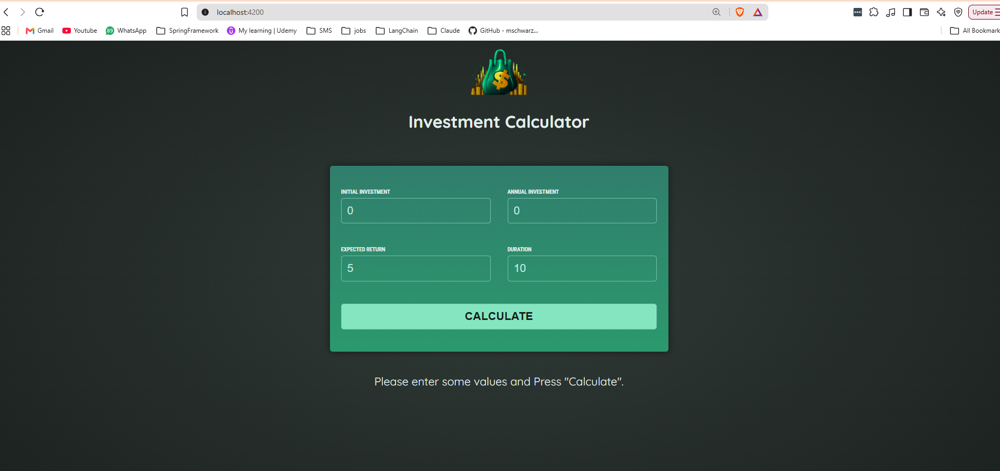
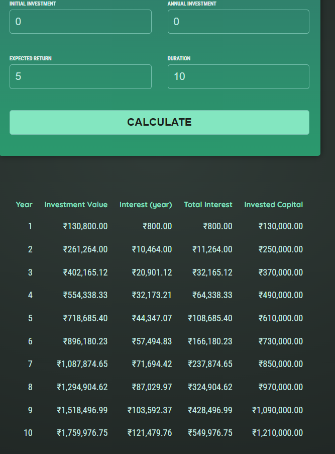

# Investment Calculator

An Angular application that calculates the projected value of a recurring investment. The user enters an initial investment, annual contribution, expected annual return, and investment duration. The application then displays one result row for each year.

This project is part of the Maximilian Schwarzmuller Angular practice course and uses Angular 19, TypeScript, template-driven forms, Angular Signals, and an injectable service for shared state.

## Requirements

- Node.js with npm installed. Use a current LTS version where possible.
- Angular CLI is available through the local project dependency, so a global Angular CLI installation is not required.

Check the installed versions:

```bash
node --version
npm --version
```

## Installation

The Angular project is inside the `01-starting-project` directory. From the repository root, enter that directory and install its dependencies:

```bash
cd 01-starting-project
npm install
```

## Running the application

Start the development server from `01-starting-project`:

```bash
npm start
```

The application is normally available at [http://localhost:4200/](http://localhost:4200/). Angular watches the source files and rebuilds the application when files change.

The equivalent Angular CLI command is:

```bash
npx ng serve
```

To use another port:

```bash
npx ng serve --port 4300
```

Stop the server with `Ctrl+C`.

## Using the application

1. Enter the initial amount invested.
2. Enter the amount invested at the end of each year.
3. Enter the expected annual return as a percentage.
4. Enter the number of years.
5. Select **Calculate**.

The form resets to its default values after submission. The results table then shows the investment value, interest earned in each year, total interest, and total invested capital.

## Architecture

The application uses an NgModule-based Angular structure. Components are responsible for presentation and user interaction, while `InvestmentService` owns the calculation and shared results state.

```text
main.ts
  |
  +-- platformBrowserDynamic().bootstrapModule(AppModule)
									  |
									  +-- AppModule
											|
											+-- AppComponent
												  |
												  +-- HeaderComponent
												  |
												  +-- UserInputModule
												  |     |
												  |     +-- UserInputComponent
												  |           |
												  |           +-- InvestmentService
												  |
												  +-- InvestmentResultsComponent
														|
														+-- InvestmentService
```

### Data flow

1. `UserInputComponent` stores the four form values in Angular Signals.
2. Submitting the form converts those values from strings to numbers and creates an `InvestmentInput` object.
3. `UserInputComponent` calls `InvestmentService.CalculateInvestmentResults(...)`.
4. `InvestmentService` calculates one object per year and stores the array in its `resultsData` Signal.
5. `InvestmentResultsComponent` reads the service Signal through a computed Signal.
6. Its template displays either the empty-state message or the results table.

Because the service is registered with `providedIn: 'root'`, both components receive the same service instance and therefore observe the same results state.

### Calculation

For each year, the service performs these operations:

```text
interest earned = current investment value * (expected return / 100)
investment value = current value + interest earned + annual investment
total invested capital = initial investment + (annual investment * year)
total interest = investment value - total invested capital
```

The result object created for each year contains:

| Property | Meaning |
| --- | --- |
| `year` | Year number, beginning at 1 |
| `interest` | Interest earned during that year |
| `valueEndOfYear` | Investment value after interest and annual contribution |
| `annualInvestment` | Annual contribution used for that calculation |
| `totalInterest` | Cumulative interest earned by the end of the year |
| `totalAmountInvested` | Initial investment plus all annual contributions so far |

## Project structure

```text
01-starting-project/
├── angular.json
├── package.json
├── README.md
├── tsconfig.json
├── tsconfig.app.json
├── tsconfig.spec.json
├── public/
│   ├── favicon.ico
│   └── investment-calculator-logo.png
└── src/
	├── index.html
	├── main.ts
	├── styles.css
	├── investment-results.ts
	└── app/
		├── app.module.ts
		├── app.component.ts
		├── app.component.html
		├── app.component.css
		├── investment-input.model.ts
		├── investment.service.ts
		├── header/
		│   ├── header.component.ts
		│   ├── header.component.html
		│   └── header.component.css
		├── user-input/
		│   ├── user-input.module.ts
		│   ├── user-input.component.ts
		│   ├── user-input.component.html
		│   └── user-input.component.css
		└── investment-results/
			├── investment-results.component.ts
			├── investment-results.component.html
			└── investment-results.component.css
```

## File-by-file guide

### Root configuration files

| File | Importance |
| --- | --- |
| `package.json` | Defines the project name, npm scripts, Angular dependencies, development dependencies, and supported tooling. |
| `package-lock.json` | Locks the exact dependency versions installed by npm. It should be committed and normally updated through `npm install`. |
| `angular.json` | Angular CLI workspace configuration. It defines the build entry point, assets, global styles, development server, production budgets, and test builder. |
| `tsconfig.json` | Shared TypeScript and Angular compiler settings. Strict template checking is enabled through `strictTemplates`. |
| `tsconfig.app.json` | Application-specific TypeScript configuration. It includes `src/main.ts` as the application entry point. |
| `tsconfig.spec.json` | TypeScript configuration for Jasmine/Karma test files. |
| `README.md` | Project documentation, including setup, architecture, commands, and file responsibilities. |

### Public assets

| File | Importance |
| --- | --- |
| `public/favicon.ico` | Browser tab icon copied into the built application. |
| `public/investment-calculator-logo.png` | Logo displayed by `HeaderComponent`. Files in `public/` are copied as static assets and referenced from the application root. |

### Application entry and global files

| File | Importance |
| --- | --- |
| `src/index.html` | The browser host page. It defines the document metadata, loads the application base URL, and contains the `<app-root>` mount point. |
| `src/main.ts` | Bootstrap entry point. It starts Angular with `AppModule` using `platformBrowserDynamic`. |
| `src/styles.css` | Global stylesheet. It defines box sizing, the page background, global typography, font imports, colors, and the reusable `.center` class. |
| `src/investment-results.ts` | Standalone calculation example retained as course/reference code. It is not imported by the active application; the live calculation is implemented in `investment.service.ts`. |

### Root application

| File | Importance |
| --- | --- |
| `src/app/app.module.ts` | Root NgModule. It declares `AppComponent`, `HeaderComponent`, and `InvestmentResultsComponent`, imports `BrowserModule` and `UserInputModule`, and bootstraps `AppComponent`. |
| `src/app/app.component.ts` | Root component class. It injects `InvestmentService` and defines the `app-root` component metadata. |
| `src/app/app.component.html` | Root layout. It places the header, input form, and results table in application order. |
| `src/app/app.component.css` | Root component stylesheet. It is currently empty and is available for styles specific to the root component. |
| `src/app/investment-input.model.ts` | TypeScript interface describing the four values required to calculate investment results. |
| `src/app/investment.service.ts` | Injectable business-logic and state service. It calculates annual projections and exposes the latest result array through an Angular Signal. |

### Header feature

| File | Importance |
| --- | --- |
| `src/app/header/header.component.ts` | Defines the `app-header` component and connects its template and stylesheet. |
| `src/app/header/header.component.html` | Displays the calculator logo and title. |
| `src/app/header/header.component.css` | Styles the header layout, logo size, spacing, and title. |

### User input feature

| File | Importance |
| --- | --- |
| `src/app/user-input/user-input.module.ts` | Feature NgModule for the input form. It imports `FormsModule` for `[(ngModel)]` and exports `UserInputComponent` for use by `AppModule`. |
| `src/app/user-input/user-input.component.ts` | Holds the four input Signals, injects `InvestmentService`, converts form values to numbers, submits calculations, and resets the form defaults. |
| `src/app/user-input/user-input.component.html` | Defines the template-driven form, input fields, labels, and Calculate button. Every input has a `name` attribute so Angular forms can track it. |
| `src/app/user-input/user-input.component.css` | Styles the form, input groups, labels, fields, button, spacing, and hover state. |

### Investment results feature

| File | Importance |
| --- | --- |
| `src/app/investment-results/investment-results.component.ts` | Reads the shared results Signal from `InvestmentService` through a computed Signal and makes the results available to the template. |
| `src/app/investment-results/investment-results.component.html` | Shows an empty-state message before calculation and iterates over annual results after calculation. It uses Angular control flow with `@if` and `@for`. |
| `src/app/investment-results/investment-results.component.css` | Styles the results table, headings, numeric content, spacing, and colors. |

## Available npm scripts

Run these commands from `01-starting-project`:

| Command | Purpose |
| --- | --- |
| `npm start` | Starts the development server. |
| `npm run build` | Creates an optimized production build in `dist/01-starting-project`. |
| `npm run watch` | Continuously builds using the development configuration with source maps. |
| `npm test` | Starts the Angular Karma test runner. |
| `npm run ng -- generate component name` | Runs an Angular CLI command through the local project CLI. |

## Building for production

```bash
npm run build
```

The production build uses the default production configuration from `angular.json`, enables output hashing, and writes generated files to:

```text
dist/01-starting-project/
```

The configured production budgets are 500 kB for the initial warning threshold and 1 MB for the initial error threshold. Component stylesheet warnings begin at 4 kB and errors at 8 kB.

## Testing

Run the configured unit-test command with:

```bash
npm test
```

The project uses Jasmine and Karma. Test files are included by `tsconfig.spec.json`. Add files using the `*.spec.ts` naming convention. There are currently no application-specific test files in the source tree.

The project does not define an end-to-end test builder. An e2e command therefore needs to be added separately if browser workflow tests are required.

## Development notes

- The application currently uses NgModules rather than standalone component bootstrapping. Component metadata therefore sets `standalone: false` where it is specified.
- Angular Signals are used for local form state and shared calculation results.
- Currency values are rendered with Angular's `CurrencyPipe` using the `INR` currency code.
- The service currently logs the generated annual data to the browser console. Remove that `console.log` before treating the application as production-ready.
- Input validation is minimal. The form uses numeric inputs, but domain rules such as positive investments, non-zero duration, and valid return ranges are not currently enforced.

## Useful Angular CLI commands

Generate a component:

```bash
npx ng generate component feature-name
```

View all available schematics:

```bash
npx ng generate --help
```

For official Angular CLI documentation, see the [Angular CLI overview and command reference](https://angular.dev/tools/cli).




